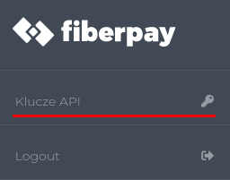
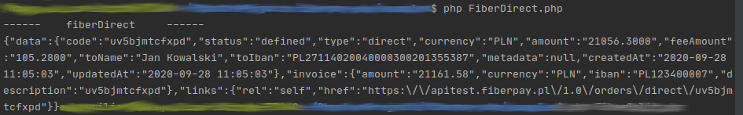
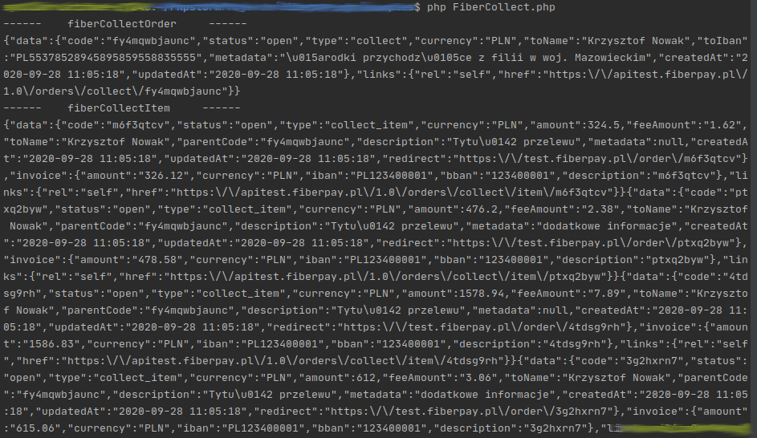

# Oficjalna biblioteka FiberPay PHP wersja 1.0

Biblioteka FiberPay PHP dostarcza przykłady integracji z systemem FiberPay API w wersji 1.0

## Wymagania
PHP >= 7.0.0 

## Dokumentacja 
[Pełna dokumentacja FiberPay](https://github.com/fiberpay/api)

# Jak korzystać z przykładów


W folderze **examples** znajdują się cztery pliki:
- FiberCollect.php
- FiberDirect.php
- FiberForward.php
- FiberSplit.php

Każdy z nich odpowiada danej usłudze, które szczegółowo opisane są w [dokumentacji](https://github.com/fiberpay/api)

___

Wewnątrz plików konieczne do wprowadzenia są dwa klucze:
1. Jawny
2. Tajny

```$apiKey = 'twój_klucz_jawny';```  

```$apiSecret = 'twój_klucz_tajny';```

Ta para kluczy możliwa jest do wygenerowania w panelu użytkownika na oficjalnej stronie serwisu [FiberPay](https://fiberpay.pl/)



___

Po wprowadzeniu kluczy należy uruchomić dany plik poprzez konsolę. Przykładowo:  

`php FiberCollect.php `

### Domyślne ustawienia

**FiberCollect** oraz **FiberSplit** to operacje, które są nieco bardziej złożone. 
W przykładach dla tych usług zostaną domyślnie utworzone Ordery oraz dodane do nich Itemy.
Gdy uruchomisz program po raz kolejny zauważyesz, że zostanie utworzony za każdym razem nowy Order.  
Bez problemu możesz wpisać utworzony wcześniej Order zamówienia w miejsce funkcji tworzącej automatycznie nowy. 
W ten sposób można przetestować dodawanie Itemów do istniejącego już Orderu.

`$parentCode = fiberCollectOrder` - domyślnie tworzy nowy Order  
`$parentCode = 'zc6ta75gfpme';` - przykładowy kod twojego Orderu  

### Response

Przy uruchomieniu każdego z przykładów API wysyła informacje, które domyślnie wyświetlą się w konsoli. Przykładowo: 
  




